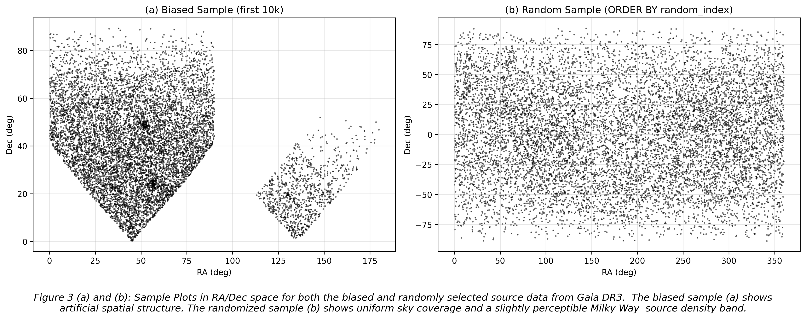
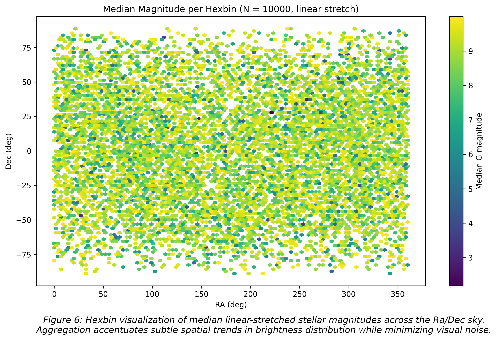

# Stellar Coordinate Explorer
A Python-based project for analyzing and visualizing stellar positions using real data from the Gaia mission. It's main focus is on coordinate transformations, spatial distributions and data interpretation.

## Project Overview
Astronomical datasets are recorded in multiple coordinate systems (e.g., ICRS, Galactic) and transforming between them is essential for understanding spatial structure.

This project explores how to:
- Work with real star catalog data
- Transform coordinates between reference frames using Astropy
- Visualize stellar distributions across the sky
- Identify and correct data-related issues such as sampling bias

## Objectives
- Transform stellar coordinates (ICRS &rarr; Galactic)
- Load and process real Gaia DR3 data
- Generate meaningful visualizations of star positions
- Analyze spatial and photometric properties of stars
- Build a structured, reproducible data analysis workflow

---
## Data Source

Data is obtained from the Gaia Archive (ESA mission):
- Catalog: gaiadr3.gaia_source
- Selection criteria:
  - `phot_g_mean_mag < 10` (bright stars)
  - `parallax > 5` (nearby stars, ~ within $200\ pc$)
  - Sample size: $10,000$ stars

Two sampling approaches were used:
1. __Biased sample__
   - Selected using `TOP 10000`
   - Resulted in uneven sky coverage
2. __Random sample (corrected)__
   - Selected using `ORDER BY random_index`
   - Produces uniform sky coverage

---
## Key Insight: Sampling Bias
Initial visualizations showed geometric clustering in RA/Dec space.

This was traced to the query method:
- `TOP 10000` returns the first rows in the database
- This introduces spatial bias

After switching to random sampling:
- The sky distribution became continuous
- The Milky Way structure emerged clearly

This highlights the importance of __representative sampling in scientific analysis__.

## Methods

### Coordinate Systems
- ICRS (RA, Dec)
- Galactic coordinates (l, b)


### Tools and Libraris
- Python
- Astropy
- Numpy
- Matplotlib

---

## Current Progress
### Data Loading & Inspection
- Loaded Gaia FITS data using Astropy Tables
- Explored structure and filtered relevant columns

### Coordinate Transformation
- Converted RA/Dec &rarr; Galactic coordinates
- Added transformed coordinates to dataset

### Sky Visualization
- Created RA vs Dec scatter plots
- Identified sampling bias in initial dataset
- Generated corrected plots using random sampling

### Magnitude Analysis
- Encoded stellar magnitude as color in scatter plots using linear and logarithmic scaling
- Used hexbin aggregation to analyze spatial trends
- Observed weak spatial dependence of brightness

### Aitoff All-Sky Projection
- Produced full-sky Aitoff projections on both equitorial and Galactic coordinates
- Observed the effect of close proximity sampling on plotted Galactic structure

---

## Key Findings
- Sampling method strongly affects observed spatial structure and interpretation
- No-random database selection introduced artificial geometric structure
- Randomized sampling reveals a physically meaningful sky distribution
- Stellar magnitude does not show strong spatial structure in this sample
- Aggregation methods (e.g., hexbin) help reveal subtle trends in noisy datasets
- The local stellar volume appears relatively isotropic in both equitorial and Galactic coordinates
---

## Limitations
- Small sample size (10,000 stars)
- Limited to nearby stars (parallax $\gt$ 5)
- No correction for interstellar extinction
- Analysis currently limited to basic statistical methods

---

## Example Visualizations
### Sky Distribution in RA/Dec Space

### Magnitude Hexbin Analysis


### Aitoff projection in ICRS and Galactic coordinates

---

## Next Steps and Planned Features
- Statistical analysis of stellar properties
- Color-Magnitude Diagram (CMD)
- Hypothesis testing (brightness vs distance)
- Interactive dashboard using Streamlit for sky exploration

---

## Project structure

```text
stellar_explorer
 |
 |------ app/
 |       |---- app.py
 |       |---- utils.py
 |------ data/
 |       |---- bright_stars_filtered_biased.fits 
 |       |---- bright_stars_filtered_random.fits 
 |       |---- gaia_subset_biased.fits
 |       |---- gaia_subset_random.fits
 |       |---- stars_with_galactic_coord_biased.fits
 |       |---- stars_with_galactic_coord_random.fits      
 |------ notebooks/
 |       |---- learning/
 |       |     |---- 01_quantities.ipynb
 |       |     |---- 02_coordinates.ipynb
 |       |     |---- 03_load_and_inspect_biased.ipynb
 |       |     |---- 04_coord_transform_biased.ipynb
 |       |     |---- 05_viz_biased.ipynb
 |       |     |---- 06_load_and_inspect_random.ipynb
 |       |     |---- 07_coord_transform_random.ipynb
 |       |     |---- 08_viz_random.ipynb
 |       |     |---- 09_colour_magnitude_random.ipynb
 |       |     |---- 10_aitoff_sky_map.ipynb
 |       |---- stellar_coordinate_explorer.ipynb
 |------ outputs/
 |       |---- images 
 |------ README.md
 ```