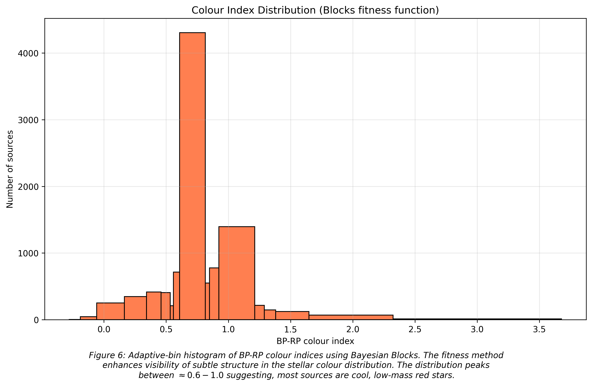
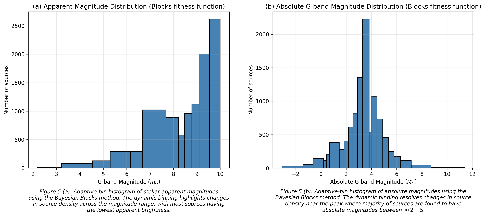
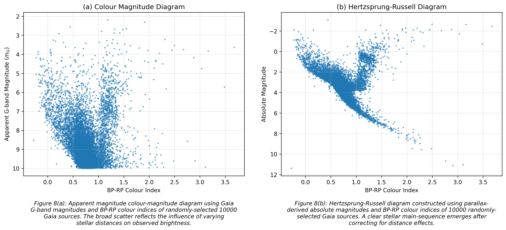
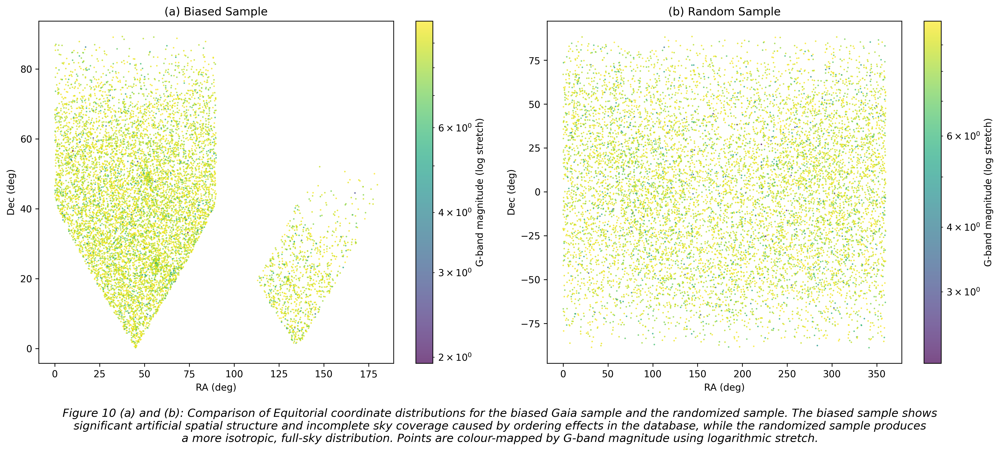
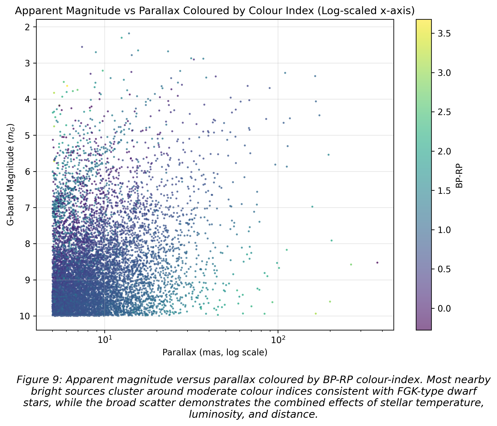

# Stellar Coordinate Explorer
A Python-based astronomy data analysis and visualization project using Gaia DR3 catalog data to explore stellar coordinates, photometric properties, and stellar populations with Python and Astropy.

---

## Project Overview
Astronomical datasets are recorded in multiple coordinate systems (e.g., ICRS, Galactic). Understanding how to transform, visualize, and interpret these systems is essential for understanding spatial structure and physical properties of stars.

This project uses real Gaia DR3 data to explore spatial distribution and photometric properties by:
- transforming stellar coordinates between reference frames using Astropy,
- exploring stellar distributions using statistical analysis,
- constructing colour-magnitude and Hertzsprung-Russell diagrams,
- investigating observational selection effects in nearby stellar samples.

---

## Main Objective
Build an interactive astronomy data-analysis and visualization tool for exploring the spatial distribution and photometric properties of nearby Gaia DR3 stellar sources.

## Specific Objectives
- Load and process real Gaia DR3 catalog data using Astropy.
- Transform stellar coordinates between ICRS and Galactic frames.
- Generate meaningful visualizations of source positions using astronomical sky maps. 
- Explore stellar population using photometric properties and statistical visualizations.
- Apply basic statistical analysis and hypothesis testing involving astronomical catalogues.
- Build a structured, reproducible astronomy data analysis workflow.
- Build an interactive Streamlit dashboard for stellar exploration.

---

## Tools and Technologies
- Python
- Astropy
- Numpy
- Matplotlib
- Jupyter Notebook
- Streamlit (planned)

---

## Dataset

Source: Gaia DR3 Archive

Selection criteria:
- Apparent G-band magnitude:
  - `phot_g_mean_mag < 10` (mainly moderately bright and faint sources)
- Parallax
  - `parallax > 5` (5 milliarcseconds which selects nearby sources, ~ within $200\ pc$)
- Sample size: `SELECT TOP 10000` ($10,000$ stellar sources)

For a randomized selection of sources, the following query was used:

```sql
SELECT TOP 10000
    source_id,
    ra, 
    dec, 
    parallax,
    phot_g_mean_mag,
    bp_rp
FROM gaiadr3.gaia_source
WHERE phot_g_mean_mag < 10
AND parallax > 5
ORDER BY random_index
```

This approximately limits the sample to sources within $\approx 200$ parsecs of Earth while avoiding artificial sky-coverage patterns, yielding a more representative sample for this project. For comparison, a biased sample was initially obtained by removing the section `ORDER BY random_index` in the ADQL query.

---

## Sample Characteristics

The dataset is dominated by nearby main-sequence stars in the solar neighbourhood. Analysis of the colour index and absolute magnitude distributions suggests the sample
primarily contains:
- Late F-type stars
- G-type stars
- Early K-type dwarf stars

The selection criteria also introduces important observational biases:
- Very faint stars are underrepresented due to the magnitude limit
- Distant Galactic plane structure is less visible because the sample probes mostly nearby stars which dot the entire celestial sky

---
## Main Analysis Notebook

[final_stellar_coordinate_explorer_analysis](./notebooks/final_stellar_coordinate_explorer_analysis.ipynb)

This notebook integrates the complete analysis workflow and includes the followig:

### Visualizations and Analysis

- ICRS sky-position scatter plots
- Colour-coded stellar maps
- Hexbin density visualization
- Full-sky Aitoff projections (Galactic and Equitorial coordinate frames)
- Apparent magnitude distribution
- Absolute magnitude distribution
- Parallax histograms
- BP-RP colour index distributions
- Hertzsprung-Russell diagram
- Colour-magnitude diagram using apparent (G-band) magnitude
- Selection Bias comparison
- Magnitude vs Parallax Analysis

### Key Findings
#### Spatial DIstribution
- The random Gaia sample produces an approximately isotropic sky distribution.
- No strong Galactic plane concentration is observed because the sample is limited to nearby stars.
#### Stellar Population
- BP-RP colour-index disributions peak around moderate values consistent with FGK-type stars.
- Absolute magnitude distributions peak near $M\approx 3-5$, which is also consistent with nearby solar-type main-sequence populations and dwarf populations.
#### Hertzsprung-Russel Diagram
- The HR diagram reveals a strong main-sequence stellar population.
- The densest stellar concentration occurs around moderate colour indices and intermediate absolute magnitudes.
#### Hypothesis Testing
Tested the hypothesis: "Nearby stars tend to appear brighter."
Results include:
- Pearson correlation: $r = 0.198$
- Spearman correlation: $r_{s} = -0.190$
- Very small p-values indicating statistical significance
- Linear regression fit yielded the relation: $Apparent\ Magnitude = -0.024 \times Parallax + 8.888$ while $R^{2} = 0.039$

Intepretation:
- Nearby stars tend to appear brighter on average.
- However, distance alone explains only a small fraction of brightness variation because stars possess intrinsically different luminosities.

### Example Figures
The following figures highlight the spatial distribution and photometric properties of the Gaia DR3 sample.
- Full-sky Aitoff projections (ICRS and Galactic)

- BP-RP colour index distributions

- Magnitude distributions

- Colour-Magnitude and Hertzsprung-Russell Diagrams

- Selection Bias comparisons
  
- Apparent Magnitude vs Distance



### Supporting Notebooks

|Notebook | Description|
|----------|----------------|
|`01_quantities.ipynb`  | Astropy quantiles and unit conversions |
|`02_coordinates.ipynb` | Coordinate systems and frame transformations |
|`03_load_and_inspect_biased.ipynb` | Loading and inspecting biased data|
|`04_coord_tranform_biased.ipynb` | Converting ICRS coordinates to Galactic coordinates with biased data|
|`05_viz_biased.ipynb` | Initial stellar position visualizations with biased data|
|`06_load_and_inspect_random.ipynb` | Loading and inspecting random data|
|`07_coord_transform_random.ipynb` | Converting ICRS coordinates to Galactic coordinates with random data|
|`08_viz_random.ipynb` | Initial stellar position visualizations using random data |
|`09_colour_magnitude_random` | Magnitude-coloured sky maps and hexbin analysis on random data |
|`10_aitoff_sky_map.ipynb` | Full-sky Aitoff projections in Equitorial and Galactic coordinates using random data |
|`11_histograms_cmds_HR` | Histograms and statistical distributions of random data | 
|`12_compare_biased_random.ipynb` | Comparing random data stellar position visualizations with biased data|
|`13_hypothesis_testing.ipynb` | Correlation analysis between magnitude and parallax using random data|

---

## Next Steps and Planned Features
- Interactive dashboard using Streamlit
- Coordinate-system toggle (ICRS &rarr; Galactic)
- Interactive magnitude filtering
- Plotly-based interactive sky maps
- Exportable plots and analysis summaries

---

## Project structure

```text
stellar_explorer
 |
 |------ app/
 |       |---- app.py
 |       |---- utils.py
 |------ data/
 |       |---- bright_stars_filtered_biased.fits 
 |       |---- bright_stars_filtered_random.fits 
 |       |---- gaia_subset_biased.fits
 |       |---- gaia_subset_random.fits
 |       |---- stars_with_galactic_coord_biased.fits
 |       |---- stars_with_galactic_coord_random.fits      
 |------ notebooks/
 |       |---- learning/
 |       |     |---- 01_quantities.ipynb
 |       |     |---- 02_coordinates.ipynb
 |       |     |---- 03_load_and_inspect_biased.ipynb
 |       |     |---- 04_coord_transform_biased.ipynb
 |       |     |---- 05_viz_biased.ipynb
 |       |     |---- 06_load_and_inspect_random.ipynb
 |       |     |---- 07_coord_transform_random.ipynb
 |       |     |---- 08_viz_random.ipynb
 |       |     |---- 09_colour_magnitude_random.ipynb
 |       |     |---- 10_aitoff_sky_map.ipynb
 |       |     |---- 11_histograms_cmds_HR.ipynb
 |       |     |---- 12_compare_biased_random.ipynb
 |       |     |---- 13_hypothesis_testing.ipynb
 |       |---- final_stellar_coordinate_explorer_analysis.ipynb
 |------ outputs/
 |       |---- images 
 |------ README.md
 ```

---
## Why this project matters
 This project demonstrates practical applications of:
 - computational astronomy
 - scientific Python workflow
 - coordinate transformations
 - observational data analysis
 - statistical reasoning
 - scientific visualization

---

## References

### Data Sources
- ESA Gaia Archive (Gaia DR3): https://gea.esac.esa.int/archive/
- Gaia Mission Overview (European Space Agency): https://www.esa.int/Science_Exploration/Space_Science/Gaia

### Python Libraries
- Astropy Project: https://www.astropy.org/
- Astropy Documentation: https://docs.astropy.org/
- Numpy Documentation: https://numpy.org/
- Matplotlib Documentation: https://matplotlib.org/