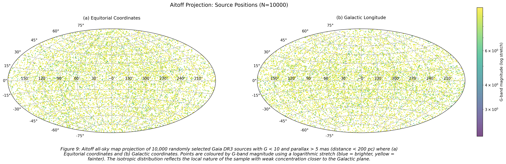
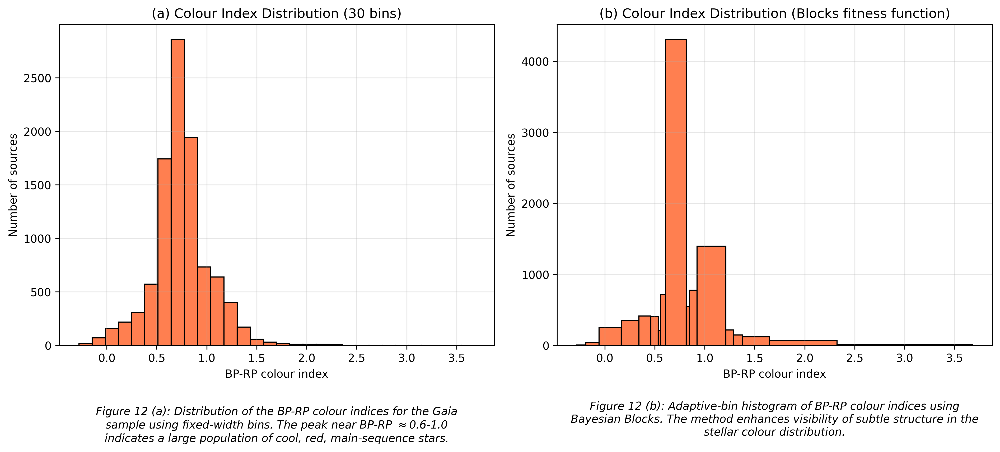
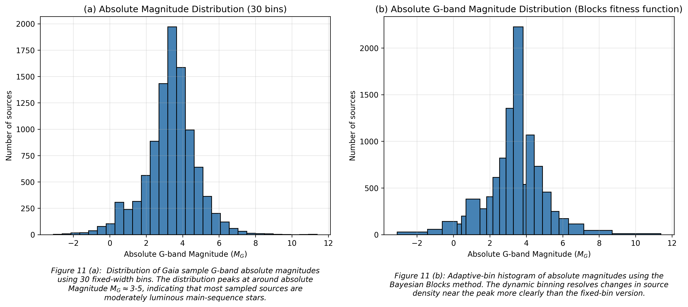
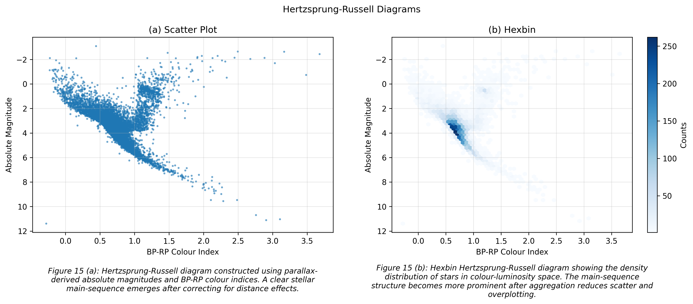
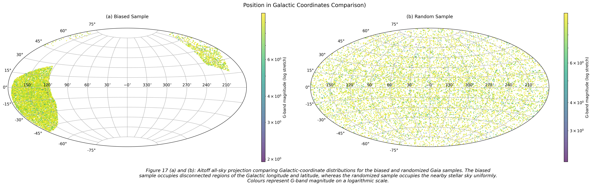
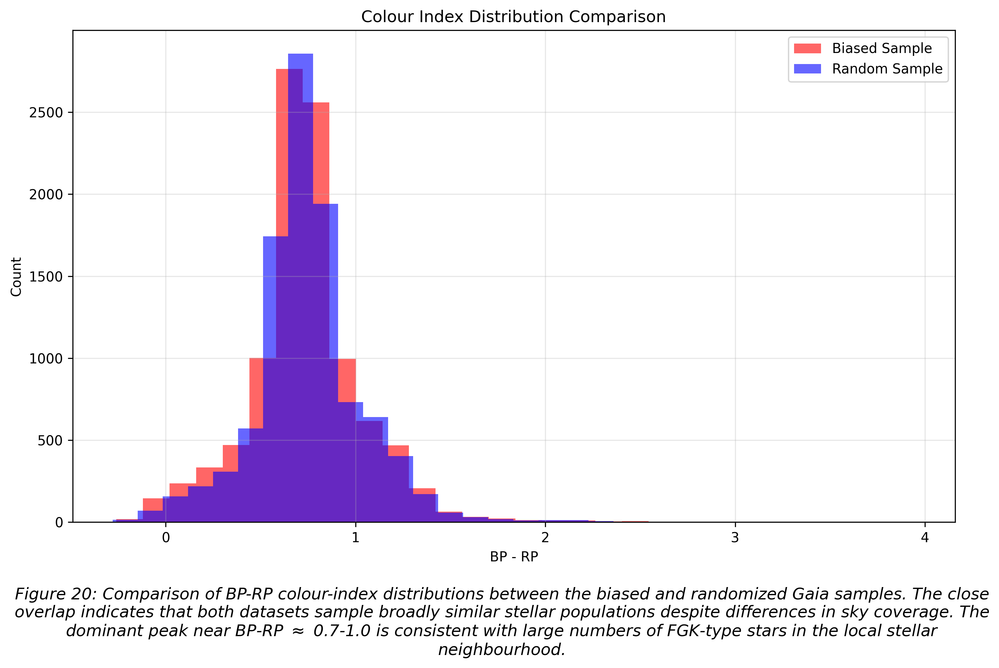

# Stellar Coordinate Explorer
A Python-based astronomy data analysis and visualization project using Gaia DR3 catalog data to explore stellar coordinates, photometric properties, and stellar populations with Python and Astropy.

---

## Project Overview
Astronomical datasets are recorded in multiple coordinate systems (e.g., ICRS, Galactic). Understanding how to transform, visualize, and interpret these systems is essential for understanding spatial structure and physical properties of stars.

This project uses real Gaia DR3 data to explore spatial distribution and photometric properties by:
- transforming stellar coordinates between reference frames using Astropy,
- exploring stellar distributions using statistical analysis,
- constructing colour-magnitude and Hertzsprung-Russell diagrams,
- investigating observational selection effects in nearby stellar samples.

---

## Main Objective
Build an interactive astronomy data-analysis and visualization tool for exploring the spatial distribution and photometric properties of nearby Gaia DR3 stellar sources.

## Specific Objectives
- Load and process real Gaia DR3 catalog data using Astropy.
- Transform stellar coordinates between ICRS and Galactic frames.
- Generate meaningful visualizations of source positions using astronomical sky maps. 
- Explore stellar population using photometric properties and statistical visualizations.
- Build a structured, reproducible astronomy data analysis workflow.
- Build an interactive Streamlit dashboard for stellar exploration.

---

## Data Source

Data is obtained from the Gaia DR3 sources archive. The ADQL query includes the following:
- Apparent G-band magnitude:
  - `phot_g_mean_mag < 10` (mainly moderately bright and faint sources)
- Parallax
  - `parallax > 5` (nearby sources, ~ within $200\ pc$)
- Sample size: `SELECT TOP 10000` ($10,000$ stellar sources)

For a randomized selection of sources, the following query was used

```sql
SELECT TOP 10000
    source_id,
    ra, 
    dec, 
    parallax,
    phot_g_mean_mag,
    bp_rp
FROM gaiadr3.gaia_source
WHERE phot_g_mean_mag < 10
AND parallax > 5
ORDER BY random_index
```

This approximately limits the sample to sources within $\approx 200$ parsecs of Earth while avoiding artificial sky-coverage patterns, yielding a more representative sample for this project. For comparison, a biased sample was initially obtained by removing the section `ORDER BY random_index` in the ADQL query.

---

## Sample Characteristics

The dataset is dominated by nearby main-sequence stars in the solar neighbourhood. Analysis of the colour index and absolute magnitude distributions suggests the sample
primarily contains:
- Late F-type stars
- G-type stars
- Early K-type dwarf stars

The selection criteria also introduces important observational biases:
- Very faint stars are underrepresented due to the magnitude limit
- Distant Galactic plane structure is less visible because the sample probes mostly nearby stars

## Tools and Technologies
- Python
- Astropy
- Numpy
- Matplotlib
- Jupyter Notebook
- Streamlit (planned)

---

## Visualizations and Analysis

Current visualizations include:

- ICRS sky-position scatter plots
- Colour-coded stellar maps
- Hexbin density visualizations
- Full-sky Aitoff projections
- Apparent magnitude distributions
- Absolute magnitude distributions
- Parallax histograms
- BP-RP colour index distributions
- Hertzsprung-Russell diagrams
- Colour-magnitude diagrams using absolute magnitude
- Selection Bias comparisons

---

### Key Findings
- The sky distribution of randomly selected sources appears approximately isotropic, with no strong concentration along the Galactic plane.
- The biased dataset exhibits strong spatial-selection artifacts despite similar photometric properties.
- The colour index distribution peaks around BP-RP $\approx 0.6-1.0$, consistent with moderately cool dwarf and sun-like stars.
- The absolute magnitude distribution peaks around $M_{G}\approx 3-5$, broadly matching late F-, G-, and early K-type main-sequence stars.
- Hertzsprung-Russel diagams reveal a clear stellar main sequence within the nearby Gaia sample.

### Featured Visualizations
The following figures highlight the spatial distribution and photometric properties of the Gaia DR3 sample.
- Full-sky Aitoff projections (ICRS and Galactic)

- BP-RP colour index distributions

- Absolute magnitude distributions

- Hertzsprung-Russell diagrams

- Selection Bias comparisons
  - Distribution in the Galactic Sky
  
  - Colour-Index distribution
- 
---

## Next Steps and Planned Features
- Hypothesis testing (brightness vs distance)
- Interactive dashboard using Streamlit
- Coordinate-system toggle (ICRS &rarr; Galactic)
- Interactive magnitude filtering
- Plotly-based interactive sky maps
- Exportable plots and analysis summaries

---

## Project structure

```text
stellar_explorer
 |
 |------ app/
 |       |---- app.py
 |       |---- utils.py
 |------ data/
 |       |---- bright_stars_filtered_biased.fits 
 |       |---- bright_stars_filtered_random.fits 
 |       |---- gaia_subset_biased.fits
 |       |---- gaia_subset_random.fits
 |       |---- stars_with_galactic_coord_biased.fits
 |       |---- stars_with_galactic_coord_random.fits      
 |------ notebooks/
 |       |---- learning/
 |       |     |---- 01_quantities.ipynb
 |       |     |---- 02_coordinates.ipynb
 |       |     |---- 03_load_and_inspect_biased.ipynb
 |       |     |---- 04_coord_transform_biased.ipynb
 |       |     |---- 05_viz_biased.ipynb
 |       |     |---- 06_load_and_inspect_random.ipynb
 |       |     |---- 07_coord_transform_random.ipynb
 |       |     |---- 08_viz_random.ipynb
 |       |     |---- 09_colour_magnitude_random.ipynb
 |       |     |---- 10_aitoff_sky_map.ipynb
 |       |     |---- 11_histograms_cmds_HR.ipynb
 |       |     |---- 12_compare_biased_random.ipynb
 |       |---- stellar_coordinate_explorer.ipynb
 |------ outputs/
 |       |---- images 
 |------ README.md
 ```